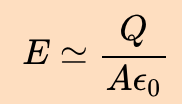
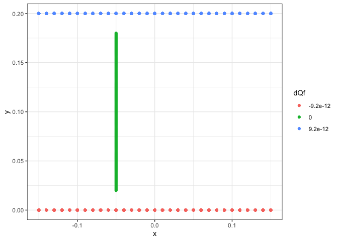
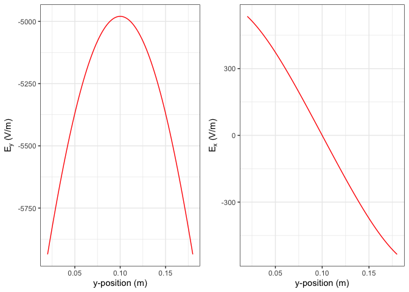

README
================
Thomas Gredig
4/10/2020

# ElectricFieldCapacitor

In a parallel plate capacitor the electric field \(E\) in the center is
approximately constant and can be approximated with



if the capacitor separation distance \(d\) is much smaller than the
plate size L. If the plates are not sufficiently close, then the
electric field is not constant.

The problem at hand is a capacitor with 20cm separation and square
plates of 30cm length, and area \(A=L^2\) of 900cm\(^2\). If a potential
of 1200V is applied what is the potential difference of 16cm in the
middle part of the capacitor.

We make a calculation in this particular case, see the code for
[ComputeElectricField.R](ComputeElectricField.R).

``` r
library(ggplot2)
library(cowplot)
```

    ## 
    ## ********************************************************

    ## Note: As of version 1.0.0, cowplot does not change the

    ##   default ggplot2 theme anymore. To recover the previous

    ##   behavior, execute:
    ##   theme_set(theme_cowplot())

    ## ********************************************************

``` r
source('func.R')
K = 9e9       # dielectric constant in vacuum 
Q = 8.8e-9    # charge on plate in [Q]
L1 = 0.15     # half the plate distance, in [m]
D1 = 0.2      # plate separation distance in [m]
```

# Setup Finite Charge Planes

``` r
# create a square source charge at y = 0 (neg charge) and y=0.2 (pos charge)
sx = c(seq(from=-L1, to=L1, by=0.01),seq(from=-L1, to=L1, by=0.01))
l1 = length(sx)/2
sz = c(seq(from=-L1, to=L1, by=0.01),seq(from=-L1, to=L1, by=0.01))
l2 = length(sz)/2
sx = rep(sx,each=l2)
sz = rep(sz,times=l1)
l3 = length(sx)/2
sy = c(rep(D1, l3), rep(0, l3))
# split the total charge into small charges
dQ = c(rep(Q/l3,l3), rep(-Q/l3,l3))
```

# Computation

``` r
d1 = data.frame()
for(oy in seq(from=0.18, to=0.02, by=-0.001)) {
  ox=-0.05
  numericallyAddElectricFieldSquare(dQ, sx, sy, sz, ox, oy) -> E
  d1 = rbind(d1, data.frame(x=ox, y=oy, dQ=0, Ex=E[1], Ey=E[2]))
}
```

# Display Plates with Charges and Integration Path

``` r
d = data.frame( x=sx,y=sy,dQ)
d=rbind(d,d1[,1:3])
d$dQf = factor(signif(d$dQ,2))
ggplot(d, aes(x,y,col=dQf))+
  geom_point() + theme_bw() + xlab('x') + ylab('y')
```

<!-- -->

``` r
p1 <- ggplot(d1, aes(y, Ey)) +
  geom_line(col='red') +
  xlab('y-position (m)') +
  ylab(expression(paste('E'[y],' (V/m)'))) +
  theme_bw()

p2 <- ggplot(d1, aes(y, Ex)) +
  geom_line(col='red') +
  xlab('y-position (m)') +
  ylab(expression(paste('E'[x],' (V/m)'))) +
  theme_bw()
plot_grid(p1,p2)
```

<!-- -->

# Compute the Potential Difference and Work

``` r
dV = sum(diff(d1$y)*d1$Ey[-1])
dV
```

    ## [1] 849.2589

``` r
# work
1.6e-19*dV
```

    ## [1] 1.358814e-16
